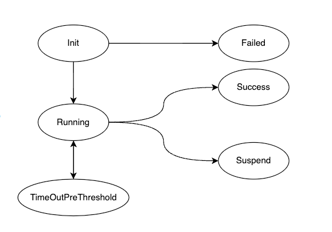

# AlterShield Operator是什么
## 简介
Operator的定位是作为AlterShield在云原生领域变更的感知并扩充整个变更防控的服务领域，我们的目标是打造一个通用的[Kubernetes Custom Resource][CRD]防控框架。

AlterShield Operator是一款基于[Operator-SDK][Operator-SDK]开发的Kubernetes Operator，旨在通过对Workload资源的管控，提高Kubernetes集群的稳定性和可靠性。
这样AlterShield不仅适用于传统的SOA架构，同时也能很好的支持云原生化的微服务系统设计。

你也可以脱离[AlterShield][AlterShield]主端，独立的快速部署operator到你的Kubernetes集群中，当前已经实现对[Deployment][Deployment]变更的感知，
变更防御，变更拦截，变更自愈与回滚。其他更多的Workload管控以及更多发布方式支持正在开发中～

## 设计
在Kubernetes中，[Pod][Pod]是Kubernetes中的最小部署单元。Pod 通常被用来承载一组相关的容器，共同完成某个任务。
Workload 是 Kubernetes 中一种管理应用程序部署的抽象层。它可以帮助用户在Kubernetes集群中部署、管理和监控应用程序。Workload 包括 [Deployment][Deployment]、[StatefulSet][StatefulSet]、[DaemonSet][DaemonSet]、[Job][Job] 和 [CronJob][CronJob]，这些 Workload 对象定义了应用程序部署的不同方式和行为。

在机器人和自动化中，控制回路是一种调节系统状态的非终止回路。用户也可以定义自己的资源，并定制自己的资源的调和逻辑。
针对Kubernetes的设计理念，我们了定义两种的CRD，分别是[ChangeWorkload][Change WorkLoad]以及[ChangePod][Change Pod]，这两种CRD主要用来描述并定义变更，同时跟踪整个变更生命周期。

生命周期如下：

基本思路是通过Kubernetes的Api Server的[WebHook][WebHook]能力感知CRD的更新，
对WorkLoad的更新操作我们通常定义成一种变更，而最小变更单元对应于Kubernetes最小调度单元Pod。这套设计理念和AlterShield定义的变更信息模型也是相呼应的。
通过CRD我们可以声明式的描述并定义出变更，同时Operator内部实现了go语言版本的AlterShield client，按照标准的[变更信息模型][ChangeModel]接入到AlterShield。

## 功能
AlterShield Operator当前具备的功能：

1. 准入控制，对Deployment资源的部署进行管控，防止异常状态下的资源部署

2. 运行检测，对Deployment资源下的POD进行监测，确保资源的运行状态

3. 回滚自愈，对Deployment资源的异常状态进行自动回滚，自愈回滚异常的发布

通过这些功能，AlterShield Operator可以帮助用户更好地管理Kubernetes集群中的Workload资源，提高系统的稳定性和可靠性。

## RoadMap
1、第一阶段（已经实现）
- [x] Operator快速体验对K8S集群中原生的Deployment变更感知、变更防御、变更拦截、变更自愈（回滚）
- [x] 内置go语言版本的AlterShield SDK标准G2场景接入

2、第二阶段
- [ ] CRD防控框架的抽象，支持快速接入自定义的CRD的变更感知
- [ ] 抽象对AlterShield的依赖，支持完全独立的使用Operator应用变更防控框架
- [ ] 提供插件化的校验服务能力，支持声明式的校验规则编写

3、第三阶段
- [ ] 支持智能算法的防御校验服务，接入云原生监控组件即可开箱即用

[AlterShield]:https://github.com/traas-stack/altershield
[Change WorkLoad]:https://github.com/traas-stack/altershield-operator/blob/main/apis/app.ops.cloud.alipay.com/v1alpha1/changeworkload_types.go
[Change Pod]:https://github.com/traas-stack/altershield-operator/blob/main/apis/app.ops.cloud.alipay.com/v1alpha1/changepod_types.go
[ChangeModel]:https://traas-stack.github.io/altershield-docs/zh-CN/open-change-management-specification/change-model/
[Pod]:https://kubernetes.io/docs/concepts/workloads/pods/
[Operator-SDK]:https://sdk.operatorframework.io/
[CRD]:https://kubernetes.io/docs/concepts/extend-kubernetes/api-extension/custom-resources/
[Deployment]:https://kubernetes.io/docs/concepts/workloads/controllers/deployment/
[WebHook]:https://kubernetes.io/docs/reference/access-authn-authz/
[StatefulSet]:https://kubernetes.io/docs/concepts/workloads/controllers/statefulset/
[DaemonSet]:https://kubernetes.io/docs/concepts/workloads/controllers/daemonset/
[Job]:https://kubernetes.io/docs/concepts/workloads/controllers/job/
[CronJob]:https://kubernetes.io/docs/concepts/workloads/controllers/cron-jobs/
[HoloInsight]:https://github.com/traas-stack/holoinsight
[Prometheus]:https://prometheus.io/

## 参与共建
如果您对云原生环境下的变更有无法感知，无法防控，无法自愈等痛点问题，欢迎参与进Operator的共建。
我们期望定义的[变更信息模型][ChangeModel]在云原生领域也是通用的，但是此项目更多的是在探索云原生社区的变更到底如何定义，
什么样子的变更防控技术框架是更云原生化的。上述的RoadMap基本阐述了我们探索的计划，期望寻找更多云原生社区，SRE社区以及稳定性社区的成员加入一起完善更通用的变更信息模型以及CRD防控框架。

你可能参与的方式有：

1、定义你自己的CRD webhook并转换为内置的CRD变更信息模型

2、接入并扩展开源的云原生监控组件，例如[HoloInsight][HoloInsight]，[Prometheus][Prometheus]

3、参与CRD防控框架的方案讨论与落地

4、参与规则化的校验功能模块的开发

<!-- LICENSE -->
## 开源许可

根据Apache2.0许可证分发。更多信息请查看 LICENSE。

<!-- CONTACT -->
## Contact
- 邮箱地址: traas_stack@antgroup.com / altershield.io@gmail.com
- 钉钉群 [二维码](./docs/dingtalk.png)
- 微信公众号 [二维码](./docs/wechat.jpg)
- 

